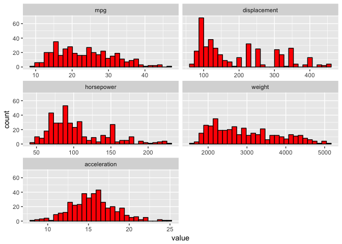

Auto MPG Data Analysis
================

### Load libraries

``` r
library(knitr)
library(dplyr)
```

    ## 
    ## Attaching package: 'dplyr'

    ## The following objects are masked from 'package:stats':
    ## 
    ##     filter, lag

    ## The following objects are masked from 'package:base':
    ## 
    ##     intersect, setdiff, setequal, union

``` r
library(corrplot)
```

    ## corrplot 0.84 loaded

``` r
library(visreg)
library(ggplot2)
#library(scatterplot3d)
```

GitHub Documents
----------------

This is an R Markdown format used for publishing markdown documents to GitHub. When you click the **Knit** button all R code chunks are run and a markdown file (.md) suitable for publishing to GitHub is generated.

Data Description
----------------

1.  Title: Auto-Mpg Data

2.  Sources:

<!-- -->

1.  Origin: This dataset was taken from the StatLib library which is maintained at Carnegie Mellon University. The dataset was used in the 1983 American Statistical Association Exposition.
2.  Date: July 7, 1993

<!-- -->

1.  Past Usage:
    -   See 2b (above)
    -   Quinlan,R. (1993). Combining Instance-Based and Model-Based Learning. In Proceedings on the Tenth International Conference of Machine Learning, 236-243, University of Massachusetts, Amherst. Morgan Kaufmann.
2.  Relevant Information:

This dataset is a slightly modified version of the dataset provided in the StatLib library. In line with the use by Ross Quinlan (1993) in predicting the attribute "mpg", 8 of the original instances were removed because they had unknown values for the "mpg" attribute. The original dataset is available in the file "auto-mpg.data-original".

"The data concerns city-cycle fuel consumption in miles per gallon, to be predicted in terms of 3 multivalued discrete and 5 continuous attributes." (Quinlan, 1993)

1.  Number of Instances: 398

2.  Number of Attributes: 9 including the class attribute

3.  Attribute Information:

    1.  mpg: continuous
    2.  cylinders: multi-valued discrete
    3.  displacement: continuous
    4.  horsepower: continuous
    5.  weight: continuous
    6.  acceleration: continuous
    7.  model year: multi-valued discrete
    8.  origin: multi-valued discrete
    9.  car name: string (unique for each instance)

4.  Missing Attribute Values: horsepower has 6 missing values

Including Code
--------------

You can include R code in the document as follows:

``` r
data <- read.table("http://mlr.cs.umass.edu/ml/machine-learning-databases/auto-mpg/auto-mpg.data",header = T, col.names = c("mpg","cylinders","displacement","horsepower","weight","acceleration","model_year", "origin","car_name"))
```

### Descriptive Analysis

``` r
str(data)
```

    ## 'data.frame':    397 obs. of  9 variables:
    ##  $ mpg         : num  15 18 16 17 15 14 14 14 15 15 ...
    ##  $ cylinders   : int  8 8 8 8 8 8 8 8 8 8 ...
    ##  $ displacement: num  350 318 304 302 429 454 440 455 390 383 ...
    ##  $ horsepower  : Factor w/ 94 levels "?","100.0","102.0",..: 35 29 29 24 42 47 46 48 40 37 ...
    ##  $ weight      : num  3693 3436 3433 3449 4341 ...
    ##  $ acceleration: num  11.5 11 12 10.5 10 9 8.5 10 8.5 10 ...
    ##  $ model_year  : int  70 70 70 70 70 70 70 70 70 70 ...
    ##  $ origin      : int  1 1 1 1 1 1 1 1 1 1 ...
    ##  $ car_name    : Factor w/ 305 levels "amc ambassador brougham",..: 37 232 15 162 142 55 224 242 2 102 ...

``` r
#View(data)
```

``` r
glimpse(data)
```

    ## Observations: 397
    ## Variables: 9
    ## $ mpg          <dbl> 15, 18, 16, 17, 15, 14, 14, 14, 15, 15, 14, 15, 1...
    ## $ cylinders    <int> 8, 8, 8, 8, 8, 8, 8, 8, 8, 8, 8, 8, 8, 4, 6, 6, 6...
    ## $ displacement <dbl> 350, 318, 304, 302, 429, 454, 440, 455, 390, 383,...
    ## $ horsepower   <fct> 165.0, 150.0, 150.0, 140.0, 198.0, 220.0, 215.0, ...
    ## $ weight       <dbl> 3693, 3436, 3433, 3449, 4341, 4354, 4312, 4425, 3...
    ## $ acceleration <dbl> 11.5, 11.0, 12.0, 10.5, 10.0, 9.0, 8.5, 10.0, 8.5...
    ## $ model_year   <int> 70, 70, 70, 70, 70, 70, 70, 70, 70, 70, 70, 70, 7...
    ## $ origin       <int> 1, 1, 1, 1, 1, 1, 1, 1, 1, 1, 1, 1, 1, 3, 1, 1, 1...
    ## $ car_name     <fct> buick skylark 320, plymouth satellite, amc rebel ...

``` r
head(data)
```

    ##   mpg cylinders displacement horsepower weight acceleration model_year
    ## 1  15         8          350      165.0   3693         11.5         70
    ## 2  18         8          318      150.0   3436         11.0         70
    ## 3  16         8          304      150.0   3433         12.0         70
    ## 4  17         8          302      140.0   3449         10.5         70
    ## 5  15         8          429      198.0   4341         10.0         70
    ## 6  14         8          454      220.0   4354          9.0         70
    ##   origin           car_name
    ## 1      1  buick skylark 320
    ## 2      1 plymouth satellite
    ## 3      1      amc rebel sst
    ## 4      1        ford torino
    ## 5      1   ford galaxie 500
    ## 6      1   chevrolet impala

``` r
summary(data)
```

    ##       mpg          cylinders      displacement     horsepower 
    ##  Min.   : 9.00   Min.   :3.000   Min.   : 68.0   150.0  : 22  
    ##  1st Qu.:17.50   1st Qu.:4.000   1st Qu.:104.0   90.00  : 20  
    ##  Median :23.00   Median :4.000   Median :146.0   88.00  : 19  
    ##  Mean   :23.53   Mean   :5.448   Mean   :193.1   110.0  : 18  
    ##  3rd Qu.:29.00   3rd Qu.:8.000   3rd Qu.:262.0   100.0  : 17  
    ##  Max.   :46.60   Max.   :8.000   Max.   :455.0   75.00  : 14  
    ##                                                  (Other):287  
    ##      weight      acceleration     model_year        origin     
    ##  Min.   :1613   Min.   : 8.00   Min.   :70.00   Min.   :1.000  
    ##  1st Qu.:2223   1st Qu.:13.90   1st Qu.:73.00   1st Qu.:1.000  
    ##  Median :2800   Median :15.50   Median :76.00   Median :1.000  
    ##  Mean   :2969   Mean   :15.58   Mean   :76.03   Mean   :1.574  
    ##  3rd Qu.:3609   3rd Qu.:17.20   3rd Qu.:79.00   3rd Qu.:2.000  
    ##  Max.   :5140   Max.   :24.80   Max.   :82.00   Max.   :3.000  
    ##                                                                
    ##            car_name  
    ##  ford pinto    :  6  
    ##  amc matador   :  5  
    ##  ford maverick :  5  
    ##  toyota corolla:  5  
    ##  amc gremlin   :  4  
    ##  amc hornet    :  4  
    ##  (Other)       :368

``` r
#factor(data$model_year)['levels']
print("Unique model years")
```

    ## [1] "Unique model years"

``` r
unique(data$model_year)
```

    ##  [1] 70 71 72 73 74 75 76 77 78 79 80 81 82

``` r
print("Unique origin")
```

    ## [1] "Unique origin"

``` r
unique(data$origin)
```

    ## [1] 1 3 2

``` r
print("Unique cylinders")
```

    ## [1] "Unique cylinders"

``` r
unique(data$cylinders)
```

    ## [1] 8 4 6 3 5

### Checking missing values

``` r
anyNA(data)
```

    ## [1] FALSE

``` r
is.na(data$horsepower)
```

    ##   [1] FALSE FALSE FALSE FALSE FALSE FALSE FALSE FALSE FALSE FALSE FALSE
    ##  [12] FALSE FALSE FALSE FALSE FALSE FALSE FALSE FALSE FALSE FALSE FALSE
    ##  [23] FALSE FALSE FALSE FALSE FALSE FALSE FALSE FALSE FALSE FALSE FALSE
    ##  [34] FALSE FALSE FALSE FALSE FALSE FALSE FALSE FALSE FALSE FALSE FALSE
    ##  [45] FALSE FALSE FALSE FALSE FALSE FALSE FALSE FALSE FALSE FALSE FALSE
    ##  [56] FALSE FALSE FALSE FALSE FALSE FALSE FALSE FALSE FALSE FALSE FALSE
    ##  [67] FALSE FALSE FALSE FALSE FALSE FALSE FALSE FALSE FALSE FALSE FALSE
    ##  [78] FALSE FALSE FALSE FALSE FALSE FALSE FALSE FALSE FALSE FALSE FALSE
    ##  [89] FALSE FALSE FALSE FALSE FALSE FALSE FALSE FALSE FALSE FALSE FALSE
    ## [100] FALSE FALSE FALSE FALSE FALSE FALSE FALSE FALSE FALSE FALSE FALSE
    ## [111] FALSE FALSE FALSE FALSE FALSE FALSE FALSE FALSE FALSE FALSE FALSE
    ## [122] FALSE FALSE FALSE FALSE FALSE FALSE FALSE FALSE FALSE FALSE FALSE
    ## [133] FALSE FALSE FALSE FALSE FALSE FALSE FALSE FALSE FALSE FALSE FALSE
    ## [144] FALSE FALSE FALSE FALSE FALSE FALSE FALSE FALSE FALSE FALSE FALSE
    ## [155] FALSE FALSE FALSE FALSE FALSE FALSE FALSE FALSE FALSE FALSE FALSE
    ## [166] FALSE FALSE FALSE FALSE FALSE FALSE FALSE FALSE FALSE FALSE FALSE
    ## [177] FALSE FALSE FALSE FALSE FALSE FALSE FALSE FALSE FALSE FALSE FALSE
    ## [188] FALSE FALSE FALSE FALSE FALSE FALSE FALSE FALSE FALSE FALSE FALSE
    ## [199] FALSE FALSE FALSE FALSE FALSE FALSE FALSE FALSE FALSE FALSE FALSE
    ## [210] FALSE FALSE FALSE FALSE FALSE FALSE FALSE FALSE FALSE FALSE FALSE
    ## [221] FALSE FALSE FALSE FALSE FALSE FALSE FALSE FALSE FALSE FALSE FALSE
    ## [232] FALSE FALSE FALSE FALSE FALSE FALSE FALSE FALSE FALSE FALSE FALSE
    ## [243] FALSE FALSE FALSE FALSE FALSE FALSE FALSE FALSE FALSE FALSE FALSE
    ## [254] FALSE FALSE FALSE FALSE FALSE FALSE FALSE FALSE FALSE FALSE FALSE
    ## [265] FALSE FALSE FALSE FALSE FALSE FALSE FALSE FALSE FALSE FALSE FALSE
    ## [276] FALSE FALSE FALSE FALSE FALSE FALSE FALSE FALSE FALSE FALSE FALSE
    ## [287] FALSE FALSE FALSE FALSE FALSE FALSE FALSE FALSE FALSE FALSE FALSE
    ## [298] FALSE FALSE FALSE FALSE FALSE FALSE FALSE FALSE FALSE FALSE FALSE
    ## [309] FALSE FALSE FALSE FALSE FALSE FALSE FALSE FALSE FALSE FALSE FALSE
    ## [320] FALSE FALSE FALSE FALSE FALSE FALSE FALSE FALSE FALSE FALSE FALSE
    ## [331] FALSE FALSE FALSE FALSE FALSE FALSE FALSE FALSE FALSE FALSE FALSE
    ## [342] FALSE FALSE FALSE FALSE FALSE FALSE FALSE FALSE FALSE FALSE FALSE
    ## [353] FALSE FALSE FALSE FALSE FALSE FALSE FALSE FALSE FALSE FALSE FALSE
    ## [364] FALSE FALSE FALSE FALSE FALSE FALSE FALSE FALSE FALSE FALSE FALSE
    ## [375] FALSE FALSE FALSE FALSE FALSE FALSE FALSE FALSE FALSE FALSE FALSE
    ## [386] FALSE FALSE FALSE FALSE FALSE FALSE FALSE FALSE FALSE FALSE FALSE
    ## [397] FALSE

Data Cleaning
-------------

-   Cylinders column should be factors (multi-valued discrete) not integer

``` r
#factor(data,labels=c("I","II","III")) -- dplyr %>% method passing data$cylinder as argument to fator fn
data$cylinders = data$cylinders %>%
                 factor(labels = sort(unique(data$cylinders)))
```

-   Horsepower is factor and it should be continuous numeric variable

``` r
data$horsepower = as.numeric(levels(data$horsepower))[data$horsepower]
```

    ## Warning: NAs introduced by coercion

-   Horsepower has some missing values. We will impute those by mean.

``` r
#library(zoo)
#na.aggregate(DF)
#na_count <-sapply(x, function(y) sum(length(which(is.na(y)))))
#na_count <- data.frame(na_count)
#sum(is.na(data$horsepower))

colSums(is.na(data))
```

    ##          mpg    cylinders displacement   horsepower       weight 
    ##            0            0            0            6            0 
    ## acceleration   model_year       origin     car_name 
    ##            0            0            0            0

``` r
data$horsepower[is.na(data$horsepower)] = mean(data$horsepower,na.rm = T)
```

-   Cylinders 3 & 5 has very low values. We can drop these cylinders

``` r
#data %>% group_by(cylinders) %>% summarise(length(cylinders))

data %>% group_by(cylinders) %>% count(cylinders)
```

    ## # A tibble: 5 x 2
    ## # Groups:   cylinders [5]
    ##   cylinders     n
    ##   <fct>     <int>
    ## 1 3             4
    ## 2 4           204
    ## 3 5             3
    ## 4 6            84
    ## 5 8           102

``` r
data <- data %>% filter(cylinders != 3 & cylinders != 5)
```

    ## Warning: package 'bindrcpp' was built under R version 3.4.4

``` r
#p %>% group_by(cylinders) %>% summarise(length(cylinders))
```

-   Converting Model Year to factor since it has few levels

``` r
data$model_year = data$model_year %>%
                  factor(labels = sort(unique(data$model_year)))
```

-   Converting Origin to factor since it has only 3 levels

``` r
data$origin = data$origin %>%
                  factor(labels = sort(unique(data$origin)))
```

Visual Analysis
---------------

[Learn ggplot](http://www.sthda.com/english/wiki/ggplot2-essentials)

-   Accelration data is normaly distributed. Rest are right skewed.

``` r
library(reshape2)

ggplot(data,aes(mpg, fill=cylinders)) +
  geom_histogram(color="black")
```

    ## `stat_bin()` using `bins = 30`. Pick better value with `binwidth`.


``` r
ggplot(data, aes(x=acceleration)) + 
 geom_histogram(aes(y=..density..), colour="black", fill="white")+
 geom_density(alpha=.2, fill="#FF6666") 
```

    ## `stat_bin()` using `bins = 30`. Pick better value with `binwidth`.


``` r
ggplot(data, aes(x=horsepower)) + 
 geom_histogram(aes(y=..density..), colour="black", fill="white")+
 geom_density(alpha=.2, fill="#FF6666") 
```

    ## `stat_bin()` using `bins = 30`. Pick better value with `binwidth`.


``` r
ggplot(data, aes(x=displacement)) + 
 geom_histogram(aes(y=..density..), colour="black", fill="white")+
 geom_density(alpha=.2, fill="#FF6666") 
```

    ## `stat_bin()` using `bins = 30`. Pick better value with `binwidth`.


``` r
ggplot(data, aes(x=weight)) + 
 geom_histogram(aes(y=..density..), colour="black", fill="white")+
 geom_density(alpha=.2, fill="#FF6666") 
```

    ## `stat_bin()` using `bins = 30`. Pick better value with `binwidth`.


``` r
d <- melt(data[,-c(8:9)])
```

    ## Using cylinders, model_year as id variables

``` r
ggplot(d,aes(value)) + 
    facet_wrap(~variable,scales = "free_x",nrow = 3) + 
    geom_histogram(colour="black", fill="red")
```

    ## `stat_bin()` using `bins = 30`. Pick better value with `binwidth`.



``` r
#ggplot(data,aes(mpg, fill = model_year)) + geom_histogram(stat = "bin")
#hist(data$mpg)
```

### Checking for outliers

[What is a Boxplot?](http://www.clayford.net/statistics/a-note-on-boxplots-in-r/)

``` r
ggplot(data, aes(model_year,mpg,color=cylinders)) +
  geom_boxplot()
```


``` r
ggplot(data, aes(origin,mpg)) +
  geom_boxplot()
```


-   Origin 1 has heavy weighted cars (median ~ 3400)

``` r
ggplot(data, aes(origin,weight)) +
  geom_boxplot()
```


``` r
ggplot(data, aes(cylinders,weight,fill=cylinders)) +
  geom_boxplot()
```


``` r
ggplot(data, aes(x=factor(cylinders),y=mpg,color=factor(cylinders)))+
  geom_boxplot(outlier.color = "red")
```


``` r
d <- melt(data[,-c(8:9)])
```

    ## Using cylinders, model_year as id variables

``` r
ggplot(d,aes('',value)) + 
    facet_wrap(~variable,scales = "free_x") + 
    geom_boxplot(outlier.colour="red", outlier.shape=16, outlier.size=2, notch=F)
```


### Scatterplot

-   Miles per gallon (mpg) decreasing with increase of the weight

``` r
ggplot(data,aes(weight,mpg)) +
  geom_point()+
  geom_smooth(method=lm)  
```


``` r
ggplot(data,aes(cylinders,mpg)) +
  geom_point()+
  geom_smooth(method=lm)  
```


``` r
ggplot(data,aes(displacement,mpg)) +
  geom_point()+
  geom_smooth(method=lm)  
```


``` r
ggplot(data,aes(weight, displacement)) +
  geom_point(color="red") +
  geom_smooth(method = lm)
```


-   Weight, Horsepower and Displacement are highly correlated, so we can pick one attribute out of 3

``` r
newdata <- cor(data[ , c('mpg','weight', 'displacement', 'horsepower', 'acceleration')], use='complete')
corrplot(newdata, method = "number")
```


-   6 and 8 cylinders cars are majorly built in origin 1.

``` r
ggplot(data, aes(cylinders,fill=origin)) +
  geom_bar(position = "dodge")
```


``` r
ggplot(data, aes(cylinders,fill=origin)) +
  geom_bar(position = "stack")
```


-   Significant drop in the car weights in origin 1. The reason behind it is increase in production of 4 cylinders cars those weighs less.

``` r
ggplot(data, aes(model_year, y = weight, color=origin)) +
  geom_boxplot() +
  facet_wrap(~ origin) +
  xlab('Model Year') +
  ylab('Weight') +
  ggtitle('Car Weights Distributions Over Time by Region of Origin')
```


-   We can see that over the year there was increase in the milege of the cars (Miles Per Gallon)

``` r
 ggplot(data, aes(model_year,mpg,group=1))+geom_smooth()
```

    ## `geom_smooth()` using method = 'loess'


-   Significant drop in Car Engine's horsepower over the years

``` r
 ggplot(data, aes(model_year,horsepower,group=1))+geom_smooth()
```

    ## `geom_smooth()` using method = 'loess'


### Building Linear Model - Weight is more significant among other features and it was highly correlated to Target variable MPG

-   Spliting the dataset in Train and Test (80-20)

``` r
set.seed(100)

#80%-20% split

indexes <- sample(nrow(data), (0.80*nrow(data)), replace = FALSE)

trainData <- data[indexes, ]
testData <- data[-indexes, ]
```

-   Creating the Linear Model with significant features

``` r
model <- lm(mpg~weight+horsepower+origin+model_year+displacement+acceleration,data = data)
```

-   Stats for the linear model

``` r
summary(model)
```

    ## 
    ## Call:
    ## lm(formula = mpg ~ weight + horsepower + origin + model_year + 
    ##     displacement + acceleration, data = data)
    ## 
    ## Residuals:
    ##     Min      1Q  Median      3Q     Max 
    ## -8.1393 -1.9191 -0.0825  1.7268 12.1117 
    ## 
    ## Coefficients:
    ##                Estimate Std. Error t value Pr(>|t|)    
    ## (Intercept)  37.0503735  1.9315826  19.181  < 2e-16 ***
    ## weight       -0.0059977  0.0006275  -9.558  < 2e-16 ***
    ## horsepower   -0.0176007  0.0126372  -1.393 0.164526    
    ## origin2       2.4504187  0.5213373   4.700 3.67e-06 ***
    ## origin3       2.7078752  0.5016386   5.398 1.20e-07 ***
    ## model_year71  1.1757879  0.8456351   1.390 0.165235    
    ## model_year72  0.2764670  0.8446624   0.327 0.743618    
    ## model_year73 -0.2372403  0.7637725  -0.311 0.756267    
    ## model_year74  1.6621656  0.8883731   1.871 0.062129 .  
    ## model_year75  1.0982115  0.8790243   1.249 0.212324    
    ## model_year76  1.8498595  0.8440344   2.192 0.029023 *  
    ## model_year77  3.4161269  0.8664577   3.943 9.63e-05 ***
    ## model_year78  3.2312540  0.8255592   3.914 0.000108 ***
    ## model_year79  5.4792595  0.8672687   6.318 7.60e-10 ***
    ## model_year80  9.6361010  0.9037855  10.662  < 2e-16 ***
    ## model_year81  6.9812177  0.8951441   7.799 6.38e-14 ***
    ## model_year82  8.5216803  0.8783431   9.702  < 2e-16 ***
    ## displacement  0.0097426  0.0054824   1.777 0.076373 .  
    ## acceleration  0.0060273  0.0878105   0.069 0.945313    
    ## ---
    ## Signif. codes:  0 '***' 0.001 '**' 0.01 '*' 0.05 '.' 0.1 ' ' 1
    ## 
    ## Residual standard error: 2.976 on 371 degrees of freedom
    ## Multiple R-squared:  0.863,  Adjusted R-squared:  0.8564 
    ## F-statistic: 129.9 on 18 and 371 DF,  p-value: < 2.2e-16

-   Plots for the linear model

[Plots diagnostic](http://data.library.virginia.edu/diagnostic-plots/)

``` r
plot(model)
```


``` r
visreg(model)
```


``` r
predictions <- predict(model, newdata = testData)

sqrt(mean((predictions - testData$mpg)^2))
```

    ## [1] 2.970616
